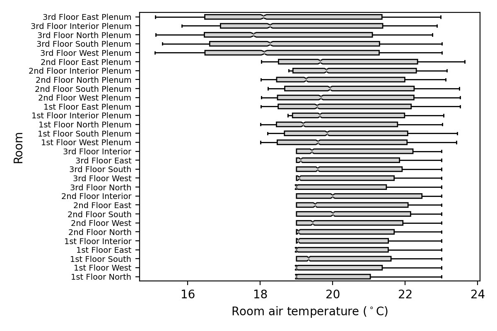
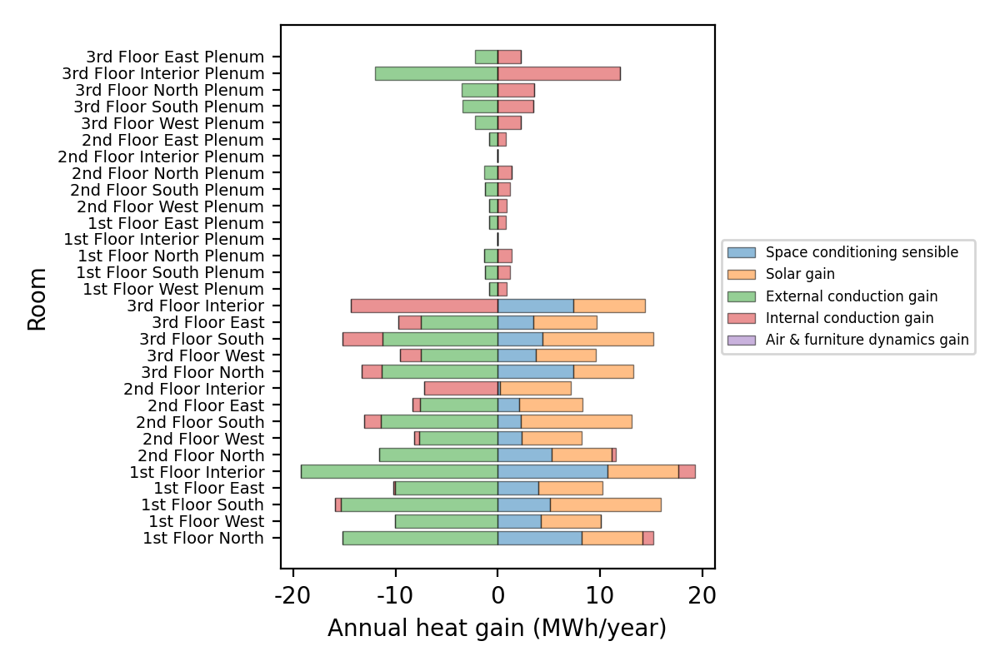

.. _example-scripts:

Example Scripts
===============

Export Results to CSV files
---------------------------

This script:

- Asks the user to open an IES-VE result file.
- Exports all of the data in the results file to separate CSV files.

This was originally published as an article here: https://www.stevenfirth.com/how-to-export-results-from-ies-using-python/

.. code-block:: python

   # ExportResultsToCSV

   # - Exports a results .aps file to multiple .csv file.
   # - Saves the following data:
   #   - weather results: {APS_FILE_NAME}_weather.csv
   #   - room-level results: {APS_FILE_NAME}_room_level_{ROOM_ID}.csv
   #   - apache system misc results: {APS_FILE_NAME}_apache_system_misc_{SYSTEM_ID}.csv
   #   - apache system energy results: {APS_FILE_NAME}_apache_system_energy_{SYSTEM_ID}.csv
   #   - apache system carbon results: {APS_FILE_NAME}_apache_system_carbon_{SYSTEM_ID}.csv
   #   - building load results: {APS_FILE_NAME}_building_loads.csv
   #   - building energy results: {APS_FILE_NAME}_building_energy.csv
   #   - building carbon results: {APS_FILE_NAME}_building_carbon.csv
   #   - surface-level results: {APS_FILE_NAME}_surface_level_{ROOM_ID}_{SURFACE_ID}.csv
   #   - opening-level results: {APS_FILE_NAME}_opening_level_{ROOM_ID}_{OPENING_ID}.csv

   # 1. Setup
   # - import packages
   import iesve
   import os
   import csv
   from tkinter import Tk, messagebox
   from tkinter.filedialog import askopenfilename
   # - instances
   current_project = iesve.VEProject.get_current_project()
   # - directories
   dir_current_project = current_project.path.replace('\\','/')
   print('dir_current_project: ', dir_current_project)
   assert os.path.exists(dir_current_project), "No IESVE project folder found."
   dir_vista = os.path.join(dir_current_project, 'vista')

   # 2. Select results file
   # - Select file
   root = Tk()
   root.withdraw()
   fp_in = askopenfilename(title = 'Select IES results file', parent = root, initialdir = dir_vista, filetypes = [("APS files","*.aps")])
   root.destroy()
   print('fp_in: ', fp_in)
   # - Exit if filepath is empty string
   if fp_in == '': 
      messagebox.showinfo('User input needed', 'Please select a .aps results file.')
      raise Exception("No results .aps file selected.")
   # - Exit if filepath is not in project filepath
   if not dir_current_project in fp_in:
      messagebox.showinfo('User input needed', 'Please select a .aps results file in the current IES project.')
      raise Exception("Results .aps file selected should be in the current IES project.")

   # 3. Export weather data
   print('Export weather data', end = ' ')
   with iesve.ResultsReader.open(fp_in) as f:
      model_level = 'w'
      variables = [x for x in f.get_variables() if x['model_level'] == model_level]  
         # [dict {'display_name': ..., 'aps_varname': ..., 'units_type': ..., 'model_level': ..., 'subtype': ..., 'custom_type': ..., 'post_process_spec': ...}]
      result = {variable['display_name']: f.get_weather_results(variable['aps_varname'], variable['display_name']) for variable in variables}
      result = {k:[None] * 8760 if v is None else v for k,v in result.items()}   # if any values are `None`, then replace with a list of [None, None, ...]
      fp_out = f'{fp_in[:-4]}_weather.csv'
      with open(fp_out, 'w', newline = '') as f1:
         csvwriter = csv.writer(f1)
         csvwriter.writerow(list(result))
         for row in zip(*list(result.values())):
               csvwriter.writerow(row)
   print()

   # 4. Export room-level data
   print('Export room-level data', end = ' ')
   with iesve.ResultsReader.open(fp_in) as f:
      model_level = 'z'
      variables = [x for x in f.get_variables() if x['model_level'] == model_level]  
      for room_id in f.get_room_ids():
         print(room_id, end = ' ')
         result = {variable['display_name']: f.get_room_results(room_id, variable['aps_varname'], variable['display_name'], model_level) for variable in variables}
         result = {k:[None] * 8760 if v is None else v for k,v in result.items()} 
         fp_out = f'{fp_in[:-4]}_room_level_{room_id}.csv'
         with open(fp_out, 'w', newline = '') as f1:
               csvwriter = csv.writer(f1)
               csvwriter.writerow(list(result))
               for row in zip(*list(result.values())):
                  csvwriter.writerow(row)
   print()

   # 5. Export apache system misc results
   print('Export apache system misc results', end = ' ')
   with iesve.ResultsReader.open(fp_in) as f:
      model_level = 'v'
      variables = [x for x in f.get_variables() if x['model_level'] == model_level] 
      for system_id in [x[1] for x in f.get_apache_systems()]:
         print(system_id, end = ' ')
         result = {variable['display_name']: f.get_apache_system_results(system_id, variable['aps_varname'], variable['display_name'], model_level) for variable in variables}
         result = {k:[None] * 8760 if v is None else v for k,v in result.items()}   
         fp_out = f'{fp_in[:-4]}_apache_system_misc_{system_id}.csv'
         with open(fp_out, 'w', newline = '') as f:
               csvwriter = csv.writer(f)
               csvwriter.writerow(list(result))
               for row in zip(*list(result.values())):
                  csvwriter.writerow(row)
   print()

   # 6. Export apache system energy results
   print('Export apache system energy results', end = ' ')
   with iesve.ResultsReader.open(fp_in) as f:
      model_level = 'j'
      variables = [x for x in f.get_variables() if x['model_level'] == model_level] 
      for system_id in [x[1] for x in f.get_apache_systems()]:
         print(system_id, end = ' ')
         result = {variable['display_name']: f.get_apache_system_results(system_id, variable['aps_varname'], variable['display_name'], model_level) for variable in variables}
         result = {k:[None] * 8760 if v is None else v for k,v in result.items()}   
         fp_out = f'{fp_in[:-4]}_apache_system_energy_{system_id}.csv'
         with open(fp_out, 'w', newline = '') as f:
               csvwriter = csv.writer(f)
               csvwriter.writerow(list(result))
               for row in zip(*list(result.values())):
                  csvwriter.writerow(row)
   print()

   # 7. Export apache system carbon results
   print('Export apache system carbon results', end = ' ')
   with iesve.ResultsReader.open(fp_in) as f:
      model_level = 'r'
      variables = [x for x in f.get_variables() if x['model_level'] == model_level] 
      for system_id in [x[1] for x in f.get_apache_systems()]:
         print(system_id, end = ' ')
         result = {variable['display_name']: f.get_apache_system_results(system_id, variable['aps_varname'], variable['display_name'], model_level) for variable in variables}
         result = {k:[None] * 8760 if v is None else v for k,v in result.items()}   
         fp_out = f'{fp_in[:-4]}_apache_system_carbon_{system_id}.csv'
         with open(fp_out, 'w', newline = '') as f:
               csvwriter = csv.writer(f)
               csvwriter.writerow(list(result))
               for row in zip(*list(result.values())):
                  csvwriter.writerow(row)
   print()

   # 8. Export building loads results
   print('Export building loads results', end = ' ')
   with iesve.ResultsReader.open(fp_in) as f:
      model_level = 'l'
      variables = [x for x in f.get_variables() if x['model_level'] == model_level]  
      result = {variable['display_name']: f.get_results(variable['aps_varname'], variable['display_name'], model_level) for variable in variables}
      result = {k:[None] * 8760 if v is None else v for k,v in result.items()}   
      fp_out = f'{fp_in[:-4]}_building_loads.csv'
      with open(fp_out, 'w', newline = '') as f1:
         csvwriter = csv.writer(f1)
         csvwriter.writerow(list(result))
         for row in zip(*list(result.values())):
               csvwriter.writerow(row)
   print()

   # 9. Export building energy results
   print('Export building energy results', end = ' ')
   with iesve.ResultsReader.open(fp_in) as f:
      model_level = 'e'
      variables = [x for x in f.get_variables() if x['model_level'] == model_level]  
      result = {variable['display_name']: f.get_results(variable['aps_varname'], variable['display_name'], model_level) for variable in variables}
      result = {k:[None] * 8760 if v is None else v for k,v in result.items()}   
      fp_out = f'{fp_in[:-4]}_building_energy.csv'
      with open(fp_out, 'w', newline = '') as f1:
         csvwriter = csv.writer(f1)
         csvwriter.writerow(list(result))
         for row in zip(*list(result.values())):
               csvwriter.writerow(row)
   print()

   # 10. Export building carbon results
   print('Export building carbon results', end = ' ')
   with iesve.ResultsReader.open(fp_in) as f:
      model_level = 'c'
      variables = [x for x in f.get_variables() if x['model_level'] == model_level]  
      result = {variable['display_name']: f.get_results(variable['aps_varname'], variable['display_name'], model_level) for variable in variables}
      result = {k:[None] * 8760 if v is None else v for k,v in result.items()}   
      fp_out = f'{fp_in[:-4]}_building_carbon.csv'
      with open(fp_out, 'w', newline = '') as f1:
         csvwriter = csv.writer(f1)
         csvwriter.writerow(list(result))
         for row in zip(*list(result.values())):
               csvwriter.writerow(row)
   print()

   # 11. Export surface_level results
   print('Export surface_level results', end = ' ')
   with iesve.ResultsReader.open(fp_in) as f:
      model_level = 's'
      variables = [x for x in f.get_variables() if x['model_level'] == model_level]  
      for body in current_project.models[0].get_bodies(False):
         room_id = body.get_room_data().id
         #print('room_id', room_id, end = ' ')
         for surface in body.get_surfaces():
               try:
                  aps_handle = surface.get_properties()['aps_handle']
               except ValueError:
                  continue
               surface_id = surface.get_properties()['id']
               print(surface_id, end = ' ')
               result = {variable['display_name']: f.get_all_surface_results(room_id, aps_handle, variable['aps_varname']) for variable in variables}
               result = {k:[None] * 8760 if v is None else v for k,v in result.items()}   
               fp_out = f'{fp_in[:-4]}_surface_level_{room_id}_{surface_id}.csv'
               with open(fp_out, 'w', newline = '') as f1:
                  csvwriter = csv.writer(f1)
                  csvwriter.writerow(list(result))
                  for row in zip(*list(result.values())):
                     csvwriter.writerow(row)
   print()

   # 12. Export opening_level results
   print('Export opening_level results', end = ' ')
   with iesve.ResultsReader.open(fp_in) as f:
      model_level = 'o'
      variables = [x for x in f.get_variables() if x['model_level'] == model_level]  
      for body in current_project.models[0].get_bodies(False):
         room_id = body.get_room_data().id
         #print('room_id', room_id, end = ' ')
         for surface in body.get_surfaces():
               try:
                  aps_handle = surface.get_properties()['aps_handle']
               except ValueError:
                  continue
               surface_id = surface.get_properties()['id']
               #print('surface_id', surface_id, end = ' ')
               surface_index = surface.index
               for opening in surface.get_openings():
                  opening_id = opening.get_id()
                  print(opening_id, end = ' ')
                  opening_index = opening.get_properties()['index']
                  result = {variable['display_name']: f.get_all_opening_results(room_id, surface_index, opening_index, variable['aps_varname']) for variable in variables}
                  result = {k:[None] * 8760 if v is None else v for k,v in result.items()}   
                  fp_out = f'{fp_in[:-4]}_opening_level_{room_id}_{opening_id}.csv'
                  with open(fp_out, 'w', newline = '') as f1:
                     csvwriter = csv.writer(f1)
                     csvwriter.writerow(list(result))
                     for row in zip(*list(result.values())):
                           csvwriter.writerow(row)
   print()

   # 13. Export hvac_node_level results
   # -- TO DO IF NEEDED --
   # n
   # get_hvac_node_results(node_nr, layer_nr = -1, var_name, start_day = -1, end_day = -1)
   # -> Numpy array of floats
   # Get the results for HVAC Node.  Use layer_nr to specify multiplex layer, or -1 for plant-side node (outside of multiplex).  See variables list for available variables and matching level.  See get_results for start_day and end_day details.
   
   # 14. Export hvac_component_level results
   # -- TO DO IF NEEDED --
   # h
   # get_hvac_component_results( component_id, component_type, var_name, start_day = -1, end_day = -1 )
   # -> Numpy array of floats
   # Get the results for HVAC Component ID + variable.  See variables list for available variables and matching level.  See get_results for start_day and end_day details.
   
   print('END')

Plot room air temperatures
--------------------------

This script:

- Asks the user to open an IES-VE result file.
- Plots the room air temperatures as a boxplot for each room.

This was originally published as an article here: https://www.stevenfirth.com/how-to-plot-temperature-results-in-ies-using-python/

.. code-block:: python

   # PlotAirTemperaturesBoxPlot

   # - This script creates a plot of the (hourly) room air temperatures for all rooms in the building.
   # - The temperatures are plotted as a boxplot for each room.

   # 1. Setup

   # - import packages
   import iesve
   import os
   import csv
   from tkinter import Tk, messagebox
   from tkinter.filedialog import askopenfilename
   import matplotlib.pyplot as plt

   # - instances
   current_project = iesve.VEProject.get_current_project()

   # - directories
   dir_current_project = current_project.path.replace('\\','/')
   print('dir_current_project: ', dir_current_project)
   if not os.path.exists(dir_current_project):
      root = Tk()
      root.withdraw()
      messagebox.showinfo('Error', 'No IESVE project folder found.', parent = root)
      root.destroy()
      quit()
   dir_vista = os.path.join(dir_current_project, 'vista')

   # 2. Select results file
   # - Select file
   root = Tk()
   root.withdraw()
   fp_in = askopenfilename(title = 'Select IES results file', parent = root, initialdir = dir_vista, filetypes = [("APS files","*.aps")])
   root.destroy()
   print('fp_in: ', fp_in)
   # - Exit if filepath is empty string
   if fp_in == '': 
      root = Tk()
      root.withdraw()
      messagebox.showinfo('User input needed', 'Please select a .aps results file.', parent = root)
      root.destroy()
      quit()
   # - Exit if filepath is not in project filepath
   elif not dir_current_project in fp_in:
      root = Tk()
      root.withdraw()
      messagebox.showinfo('User input needed', 'Please select a .aps results file in the current IES project.', parent = root)
      root.destroy()
      quit()
      
   # 3. Get room data
   # - a dictionary {room_id: room_general_data_dict}
   realmodel = current_project.models[0]
   bodies = realmodel.get_bodies(False)  # False means get all bodies
   room_data_dict = {body.id: body.get_room_data().get_general() for body in bodies}
      
   # 4. Load temperature data
   # - a dictionary {room_id: list of (hourly) temperatures}
   with iesve.ResultsReader.open(fp_in) as f:
      air_temperatures_dict = { 
         room_id: f.get_room_results(room_id, 'Room air temperature', 'Air temperature', 'z')
         for room_id in f.get_room_ids()
         }
   air_temperatures_dict = {k:v for k,v in air_temperatures_dict.items() if not v is None}

   # 5. Plot figure
   fig, ax = plt.subplots(
      figsize = (
         6, 
         min(0.4 * len(room_data_dict), 4)  # increase height of plot based on number of rooms
         ), 
      dpi = 200
      )
   ax.boxplot(
      air_temperatures_dict.values(), 
      vert = False,
      notch = True,
      patch_artist = True,  # to enable box facecolor editing
      labels = [room_data_dict[x]['name'] for x in air_temperatures_dict.keys()],  # converts room ids to room names
      boxprops={'facecolor': 'lightgrey'},
      flierprops={'marker': '.', 'markersize': 1, 'markerfacecolor': 'grey', 'markeredgecolor': 'grey'},
      medianprops={'color': 'grey'}
      )
   ax.set_ylabel('Room')
   ax.set_xlabel('Room air temperature ($^\circ$C)')
   ax.yaxis.set_tick_params(labelsize=10 - len(room_data_dict) * 3 / 30)    # reduces room name font size based on nmber of rooms
   fig.tight_layout()
   plt.show()
      

Plot room heat balance
----------------------

This script:

- Asks the user to open an IES-VE result file.
- Plots the room heat balances for each room.

This was originally published as an article here: https://www.stevenfirth.com/how-to-plot-room-heat-balance-results-in-ies-using-python/

.. code-block:: python

   # PlotRoomHeatBalance

   # - This script creates a plot of the (annual) heat gains and losses for all rooms in the building.
   # - The heat gains and losses are plotted as a horizontal stacked bars for each room.

   # 1. Setup

   # - import packages
   import iesve
   import os
   import math
   from tkinter import Tk, messagebox
   from tkinter.filedialog import askopenfilename
   import matplotlib.pyplot as plt
   import matplotlib.ticker

   # - instances
   current_project = iesve.VEProject.get_current_project()

   # - directories
   dir_current_project = current_project.path.replace('\\','/')
   print('dir_current_project: ', dir_current_project)
   if not os.path.exists(dir_current_project):
      root = Tk()
      root.withdraw()
      messagebox.showinfo('Error', 'No IESVE project folder found.', parent = root)
      root.destroy()
      quit()
   dir_vista = os.path.join(dir_current_project, 'vista')

   # 2. Select results file
   # - Select file
   root = Tk()
   root.withdraw()
   fp_in = askopenfilename(title = 'Select IES results file', parent = root, initialdir = dir_vista, filetypes = [("APS files","*.aps")])
   root.destroy()
   print('fp_in: ', fp_in)
   # - Exit if filepath is empty string
   if fp_in == '': 
      root = Tk()
      root.withdraw()
      messagebox.showinfo('User input needed', 'Please select a .aps results file.', parent = root)
      root.destroy()
      quit()
   # - Exit if filepath is not in project filepath
   elif not dir_current_project in fp_in:
      root = Tk()
      root.withdraw()
      messagebox.showinfo('User input needed', 'Please select a .aps results file in the current IES project.', parent = root)
      root.destroy()
      quit()
      
   # 3. Get room data
   # - a dictionary {room_id: room_general_data_dict}
   realmodel = current_project.models[0]
   bodies = realmodel.get_bodies(False)  # False means get all bodies
   room_data_dict = {body.id: body.get_room_data().get_general() for body in bodies}
      
   # 4. Load gain data
   # - a dictionary {variable_name: {room_id: annual_total_heat_gain}}
   # - this selects only room variables which have 'units_type' as "Gain"
   data = {}
   with iesve.ResultsReader.open(fp_in) as f:
      vars = f.get_variables() 
      for var in vars:
         d = {}
         if var['model_level'] == 'z' and var['units_type'] == 'Gain':
               for room_id in list(room_data_dict):
                  x = f.get_room_results(room_id, var['aps_varname'], var['display_name'], 'z')
                  x = sum(x) if x is not None else 0
                  d[room_id] = x/1000000  # convert to MWh/year
               data[var['display_name']] = d
               
   #for k,v in data.items(): print(k, v)

   # 5. Plot figure
   #
   height = (0.4 * len(room_data_dict))
   if height < 2: height = 2
   if height > 4: height = 4
   #
   #height = 6 / 1920 * 1080  # fixed aspect ratio for publishing figure
   #
   fig, ax = plt.subplots(
      figsize = (
         6, 
         height
         ), 
      dpi = 200
      )
   positive_lefts = [0] * len(room_data_dict)
   negative_lefts = [0] * len(room_data_dict)
   #
   def plot_row(name, data, **kwargs):
      ""
      for i, (room_id, height) in enumerate(data.items()):
         if height > 0:
               left = positive_lefts[i]
               positive_lefts[i] += height
         else:
               left = negative_lefts[i]
               negative_lefts[i] += height
         line = ax.barh(
               i, 
               height, 
               left = left, 
               label = name if i == 0 else None,
               edgecolor = 'black',
               linewidth = 0.5,
               **kwargs)
      return line
   #
   color_i = 0
   for i, (k,v) in enumerate(data.items()):
      for x in v.values():
         if not math.isclose(x,0):  # plot variable provided at least one annual total is non-zero
               plot_row(
                  k,
                  v, 
                  color = f'C{color_i}',
                  alpha = 0.5
                  )
               color_i += 1
               break
   
   ax.legend(
      loc='center left', 
      bbox_to_anchor=(1, 0.5),
      fontsize=6
      )
   ax.set_xlabel('Annual heat gain (MWh/year)')
   ax.get_xaxis().set_major_formatter(matplotlib.ticker.FuncFormatter(lambda x, p: format(int(x), ',')))  # thousands separator
   ax.set_xlim(min(negative_lefts) - (max(positive_lefts) - min(negative_lefts)) * 0.05, max(positive_lefts) + (max(positive_lefts) - min(negative_lefts)) * 0.05)  # 5% margin on either side
   ax.set_yticks(range(len(room_data_dict)))
   ax.set_yticklabels([x['name'] for x in room_data_dict.values()])
   ax.set_ylabel('Room')
   ax.yaxis.set_tick_params(labelsize=10 - len(room_data_dict) * 3 / 30)    # reduces room name font size based on nmber of rooms
   fig.tight_layout()
   plt.show()
    

